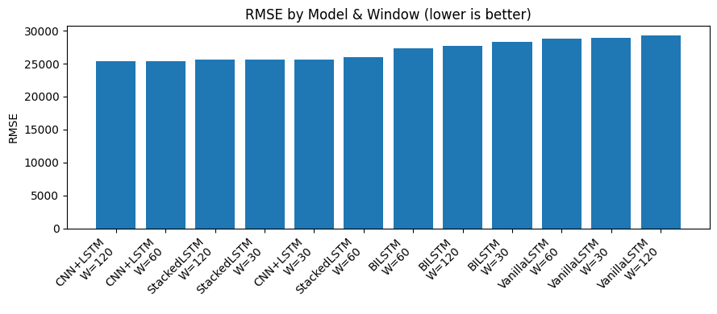
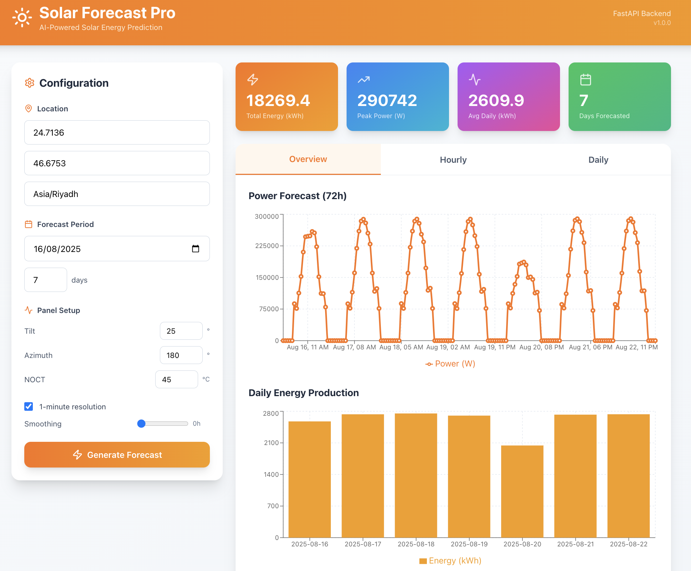

<p align="center">
  
</p>

[](https://www.python.org/downloads/)
[](https://pytorch.org/)
[](https://fastapi.tiangolo.com/)

A comprehensive solar power forecasting system comparing XGBoost and LSTM architectures for predicting active power output from solar panels.


---
## Overview

This project compares multiple forecasting models for solar power prediction:

- **XGBoost** 
- **Vanilla LSTM** 
- **Stacked LSTM** 
- **Bidirectional LSTM**
- **CNN-LSTM** 

---
## Project Structure  

```
SolarPowerProject/
├─ img/                          images for the README
├─ models/                       trained models and weights
├─ solar_forecasting_package_V2/     
│  ├─ solar_forecasting/         main ML package
│  │  ├─ preprocessing.py        data cleaning, outlier detection, time‑based splits, scaling features
│  │  ├─ feature_selection.py    compute correlation/mutual information to rank features
│  │  ├─ xgb_model.py            train an XGBoost model with early stopping and hyperparameter tuning
│  │  ├─ lstm_pytorch.py         define PyTorch LSTM models and handle sliding‑window training
│  │  ├─ metrics.py              regression metrics like MAE, RMSE, R², MAPE, sMAPE
│  │  └─ init.py                 marks this directory as a package
│  └─ usage_example.py           example script demonstrating end‑to‑end workflow
├─ solar-forecast-ui/            React frontend app
├─ api.py                        FastAPI backend for predictions
├─ streamlitApp.py               lightweight UI alternative
├─ SolarNoteBook.ipynb  V1-V2    experimental notebook
├─ LSTM_PyTorch.ipynb            experimental notebook
├─ pyproject.toml                Poetry setup
└─ requirements.txt              pip setup


```

---

## Methodology

### Data Preprocessing Pipeline

```
Step 1: Temporal Alignment
    └─→ Resample all sensors to 1-minute intervals

Step 2: Outlier Detection & Removal
    └─→ IQR method (factor=1.5)
    └─→ Z-score method (threshold=3.0)
    └─→ Replace outliers with NaN

Step 3: Missing Value Imputation
    └─→ Cross-fill between sensors (correlation > 0.95)
    └─→ Time-based interpolation
    └─→ Forward/backward fill

Step 4: Feature Scaling
    └─→ StandardScaler (zero mean, unit variance)

Step 5: Data Split (Chronological)
    └─→ Training:   70%
    └─→ Validation: 10%
    └─→ Testing:    20%
```

### Feature Selection Strategies

Two approaches were tested to compare linear vs non-linear feature importance:

#### 1. Pearson Correlation Coefficient (PCC)
Captures **linear relationships** with target variable:

```
Feature                        Correlation
─────────────────────────────────────────
Solar Irradiance POA1/2        0.985
Isc Test/Ref                   0.982
GHI                            0.950
Module Surface Temp            0.828
Temperature Reference Cell     0.819
Geff Test/Reference            0.837
Ambient Temperature            0.430
Wind Speed                     0.389
Relative Humidity             -0.342
```

#### 2. Information Gain (Mutual Information)
Captures **non-linear dependencies**:

```
Feature                        MI Score
─────────────────────────────────────────
Isc Ref                        1.586
Isc Test                       1.577
Geff Reference/Test            1.557
POA1/POA2                      1.533
Soiling Loss Indices           1.391
GHI (Wh/m²)                    1.348
Module Surface Temp            0.905
Temperature Ref Cell           0.880
```
---

## Model Architectures

### XGBoost

**Configuration:**
```
Objective:           reg:squarederror
Boosting rounds:     2000
Early stopping:      100 rounds
Learning rate (η):   0.02 - 0.05
Max depth:           4 - 8
Subsample:           0.7 - 0.9
Colsample bytree:    0.7 - 0.9

Total configurations tested: 288
```

### LSTM Models

All models tested with three window sizes: **30, 60, 120 minutes**

#### 1. Vanilla LSTM
```
Input (Window × Features)
    ↓
LSTM(64 units, dropout=0.1)
    ↓
Dense(1)
    ↓
Output
```

#### 2. Stacked LSTM
```
Input (Window × Features)
    ↓
LSTM(128 units, return_sequences=True, dropout=0.01)
    ↓
LSTM(64 units, dropout=0.2)
    ↓
Dense(1)
    ↓
Output
```

#### 3. Bidirectional LSTM
```
Input (Window × Features)
    ↓
Bidirectional LSTM(128 units, dropout=0.2)
    ↓
Bidirectional LSTM(64 units, dropout=0.2)
    ↓
Dense(1)
    ↓
Output
```

#### 4. CNN-LSTM (Best Deep Learning Model)
```
Input (Window × Features)
    ↓
Conv1D(64 filters, kernel=3, padding=1)
    ↓
ReLU + MaxPool1D(2)
    ↓
Conv1D(64 filters, kernel=3, padding=1)
    ↓
ReLU
    ↓
LSTM(64 units, dropout=0.2)
    ↓
Dense(1)
    ↓
Output
```

**Training Configuration:**
```
Optimizer:          AdamW (lr=1e-3)
Loss function:      MSE
Batch size:         256
Max epochs:         200
Early stopping:     patience=10
LR scheduler:       ReduceLROnPlateau (factor=0.5, patience=4)
Gradient clipping:  max_norm=1.0
```

---

## Results

### Overall Performance Comparison

| Model | MAE | RMSE | R² | Training Time |
|-------|-----|------|----|---------------|
| XGBoost-IG | 10,197 | 19,582 | 0.965 | 30 min |
| XGBoost-PCC | 8,938 | 19,980 | 0.964 | 30 min |
| CNN+LSTM (W=120) | 15,649 | 25,336 | 0.941 | 5 hours |
| Stacked LSTM (W=120) | 14,108 | 25,555 | 0.940 | 5 hours |
| Bidirectional (W=120) | 15,181 | 27,639 | 0.930 | 6 hours |
| Vanilla LSTM (W=120) | 17,448 | 29,248 | 0.922 | 2 hours |


### XGBoost Detailed Metrics

| Model | MAE | RMSE | R² | MAPE (%) | sMAPE (%) |
|-------|-----|------|----|----|-----|
| XGBoost-IG | 10,197 | 19,582 | 0.965 | 138.08 | 118.36 |
| XGBoost-PCC | 8,938 | 19,980 | 0.964 | 42.85 | 55.91 |
| Baseline (Yesterday) | 16,821 | 45,043 | 0.815 | 39.12 | 17.75 |

**Improvement vs Baseline:**
```
RMSE:  56.5% improvement
R²:    18.4% improvement
```

### LSTM Performance by Window Size

#### CNN+LSTM Results
```
Window    MAE      RMSE     R²      
──────────────────────────────────
30 min    15,475   25,602   0.940
60 min    15,562   25,362   0.941
120 min   15,649   25,336   0.941  ← Best
```


**RMSE Improvement Over Vanilla LSTM:**
```
CNN+LSTM        -11.9%  ████████████
Stacked LSTM    -11.1%  ███████████
Bidirectional    -3.9%  ████
Vanilla LSTM      0.0%   
```

<p align="center">
  
</p>

---

## Run It Locally  

### 1. Backend Setup  

If you’re using **Poetry**:  

```bash
poetry install
poetry run uvicorn api:app --reload --port 8000
```

Or with **pip**:  

```bash
python -m venv .venv
source .venv/bin/activate
pip install -r requirements.txt
uvicorn api:app --reload --port 8000
```


---

### 2. Frontend Setup  

<p align="center">
  
</p>


Go to the frontend folder:  

```bash
cd solar-forecast-ui
npm install
```

If you get the Tailwind/PostCSS warning:  

```bash
npm i -D @tailwindcss/postcss postcss autoprefixer tailwindcss
```


Run it:  

```bash
npm start
```


---

## 🧃 Bonus: Streamlit Quick View  

Too lazy for React? No problem.  

```bash
poetry run streamlit run streamlitApp.py
```


---

## Contact

**Author:** Alhanouf Abdulraqib  
**Email:** AlhanoufAbdulraqib@gmail.com  

---

## License

MIT License - See LICENSE file for details

---
