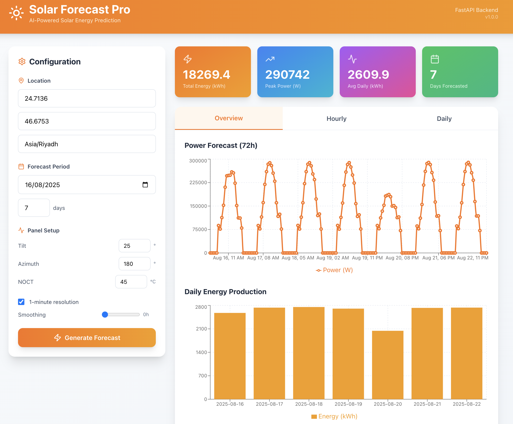

# Solar Power Forecast  

Alright picture this  
we got solar panels everywhere maybe even on a Tesla chillin in the driveway  

<p >
  
</p>

and we’re like “yeah we got this renewable energy thing figured out”  
until one cloud shows up and the whole system’s like “nah, I’m out”  

That’s why we’re here  
to stop getting roasted by the weather and start **forecasting that power**  


---

## ⚙️ Project Structure  

```
SolarPowerProject/
├─ Data/                         (it's empty because why share the data w yall)
├─ img/                          images and memes for the README
├─ models/                       trained models and weights
├─ solar_forecasting_package_V2/     
│  ├─ solar_forecasting/         main ML package
│  │  ├─ preprocessing.py        data cleaning, outlier detection, time‑based splits, scaling features
│  │  ├─ feature_selection.py    compute correlation/mutual information to rank features
│  │  ├─ xgb_model.py            train an XGBoost model with early stopping and hyperparameter tuning
│  │  ├─ lstm_pytorch.py         define PyTorch LSTM models and handle sliding‑window training
│  │  ├─ metrics.py              regression metrics like MAE, RMSE, R², MAPE, sMAPE
│  │  └─ init.py                 marks this directory as a package
│  └─ usage_example.py           example script demonstrating end‑to‑end workflow
├─ solar-forecast-ui/            React frontend app
├─ api.py                        FastAPI backend for predictions
├─ streamlitApp.py               lightweight UI alternative
├─ SolarNoteBook.ipynb  V1-V2    experimental notebook
├─ LSTM_PyTorch.ipynb            experimental notebook
├─ pyproject.toml                Poetry setup
└─ requirements.txt              pip setup
```

---

## How It Works  

1. **Training**  
   The models (XGBoost + LSTM) learn from weather and sensor data like irradiance, temperature, humidity, etc.  
   Once trained, they predict **active power** for upcoming hours or days.

2. **Backend** (`api.py`)  
   FastAPI serves the trained models.  
   You send it JSON with your features, and it returns forecasts like a boss.

3. **Frontend** (`solar-forecast-ui/`)  
   A React web app that visualizes forecasts dynamically.  
   You pick your location (like *Abha*), set how many hours to forecast, and boom — results.

---

## Run It Locally  

### 1. Backend Setup  

If you’re using **Poetry**:  

```bash
poetry install
poetry run uvicorn api:app --reload --port 8000
```

Or with **pip**:  

```bash
python -m venv .venv
source .venv/bin/activate
pip install -r requirements.txt
uvicorn api:app --reload --port 8000
```


---

### 2. Frontend Setup  

<p align="center">
  
</p>


Go to the frontend folder:  

```bash
cd solar-forecast-ui
npm install
```

If you get the Tailwind/PostCSS warning:  

```bash
npm i -D @tailwindcss/postcss postcss autoprefixer tailwindcss
```


Run it:  

```bash
npm start
```


---

## 🧃 Bonus: Streamlit Quick View  

Too lazy for React? No problem.  

```bash
poetry run streamlit run streamlitApp.py
```

---

## Credits  

Developed with caffeine, data, and occasional sunburns.  
